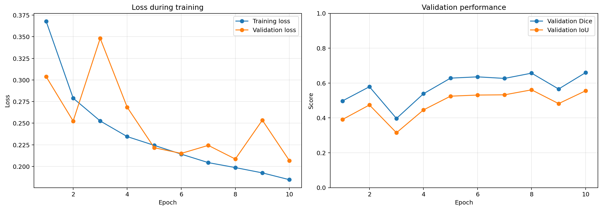

# Brain Tumor MRI Segmentation with PyTorch

A lightweight U-Net that performs binary brain-tumor segmentation on 2D contrast-enhanced T1-weighted MRI slices.

## Project overview

The model receives a grayscale brain MRI and predicts a pixel-level binary mask:

- `0`: background
- `1`: tumor

This project uses the [BRISC 2025 dataset](https://www.kaggle.com/datasets/briscdataset/brisc2025), which provides expert-reviewed MRI segmentation masks.

## Results

| Metric | Result |
|---|---:|
| Best validation Dice | 0.6599 |
| Mean test Dice | 0.6347 |
| Mean test IoU | 0.5260 |
| Example Dice | 0.8261 |
| Example IoU | 0.7037 |

The mean test results represent performance across all 860 held-out test images. The example scores represent one individual image.

## Example prediction


## Training history



## Dataset split

| Subset | Images |
|---|---:|
| Training | 3,147 |
| Validation | 786 |
| Testing | 860 |

The official BRISC training data were divided into training and internal-validation subsets. The official test set remained held out until final evaluation.

## Preprocessing

- Converted images to grayscale
- Resized images and masks to `256 × 256`
- Used bilinear interpolation for MRI images
- Used nearest-neighbor interpolation for segmentation masks
- Converted mask pixels to binary labels using a threshold of 128
- Standardized images using training-set statistics
- Training mean: `0.16675`
- Training standard deviation: `0.17332`

## Model

The model is a small two-level U-Net containing:

- Convolutional encoder
- Bottleneck
- Transposed-convolution decoder
- Skip connections
- One output logit per pixel

Training configuration:

- Framework: PyTorch
- Optimizer: Adam
- Learning rate: `0.001`
- Batch size: `8`
- Epochs: `10`
- Loss: binary cross-entropy plus soft Dice loss
- Model selection: highest validation Dice

## Repository contents

```text
brain-tumor-mri-segmentation/
├── brain_tumor_segmentation.ipynb
├── outputs/
│   ├── best_small_unet.pt
│   ├── example_prediction.png
│   ├── test_results.txt
│   └── training_history.png
├── .gitignore
├── LICENSE
└── README.md
```

The BRISC dataset is not included in this repository. The notebook downloads it from Kaggle using KaggleHub.

## Running the project

1. Open `brain_tumor_segmentation.ipynb` in Google Colab.
2. Select **Runtime → Change runtime type → GPU**.
3. Run the notebook cells in order.
4. Authenticate with Kaggle if requested.
5. The trained model and result files will be saved to Google Drive.

## Limitations

- The model processes independent 2D slices rather than complete 3D MRI volumes.
- JPEG images do not provide reliable voxel spacing or complete patient-level slice ordering.
- Predicted masks cannot be used to calculate physical tumor volume in milliliters.
- The model has not been externally evaluated on an independent hospital or dataset.
- Complete patient-level independence cannot be guaranteed from the source data.
- The results represent an educational feasibility study, not clinical validation.

## Medical disclaimer

This project is intended only for education and research. It is not a medical device and must not be used for diagnosis, treatment planning, or clinical decision-making.

## References

- Fateh A, Rezvani Y, Moayedi S, et al. [BRISC: Annotated Dataset for Brain Tumor Segmentation and Classification](https://www.nature.com/articles/s41597-026-06753-y). *Scientific Data*. 2026.
- Ronneberger O, Fischer P, Brox T. [U-Net: Convolutional Networks for Biomedical Image Segmentation](https://arxiv.org/abs/1505.04597). MICCAI. 2015.

## License

This project is available under the MIT License.
